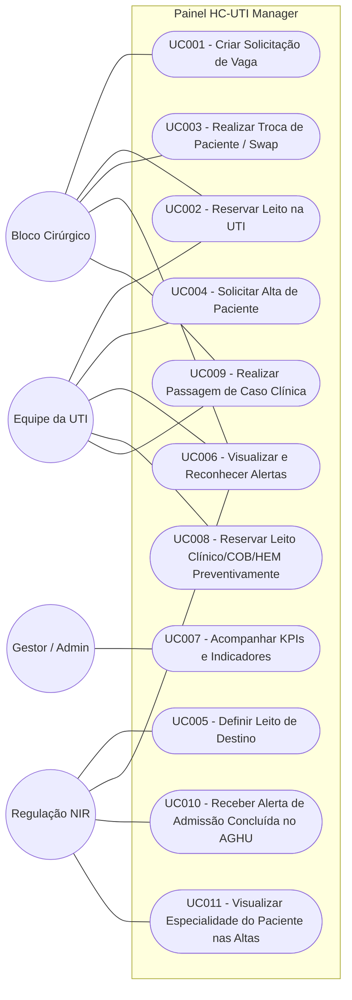

# Modelagem de Casos de Uso — HC-UTI Manager

Este documento descreve os fluxos operacionais e os limites de ação de cada ator no sistema **HC-UTI Manager**.

---

## 1. Diagrama de Casos de Uso

---

## 2. Especificação dos Casos de Uso

### UC001 — Criar Solicitação de Vaga
*   **Ator Principal:** Bloco Cirúrgico (BC).
*   **Fluxo Principal:** 
    1. O usuário digita o número do prontuário do paciente cirúrgico.
    2. O sistema faz uma consulta em tempo real no banco do AGHU (Postgres) para verificar se há cirurgia agendada para hoje ou dias futuros.
    3. O sistema importa os dados (nome, idade, especialidade, procedimento, turno e horário).
    4. O usuário define o tipo de vaga, a prioridade inicial (P1 a P10) e clica em salvar.
    5. A solicitação entra na fila como **Pendente**.

### UC002 — Reservar Leito na UTI
*   **Atores:** Equipe da UTI.
*   **Fluxo Principal:**
    1. O usuário visualiza o painel de leitos (Bed Cards) e identifica um leito vago (Disponível).
    2. O usuário seleciona uma solicitação de vaga ativa na fila e clica em **Reservar**.
    3. O sistema atualiza o status da solicitação para **Reservado**, preenche o destino (ex: *Leito 0502G*) e atualiza a reserva no banco SQLite (LeitoEstado).

### UC003 — Realizar Troca de Paciente (Swap)
*   **Ator Principal:** Bloco Cirúrgico (BC).
*   **Fluxo Principal:**
    1. O usuário edita uma solicitação existente e altera o prontuário para um novo paciente (substituição).
    2. O sistema valida se o novo paciente já possui solicitação ativa ou se ocupa leito físico na UTI.
    3. Caso o novo paciente já possua solicitação pendente no banco, o sistema executa a **Mesclagem Inteligente** (cancela a solicitação editada e transfere a reserva física/vaga para a solicitação existente do novo paciente).
    4. O sistema gera os logs adequados na auditoria e atualiza a fila de prioridades.

### UC004 — Solicitar Alta de Paciente
*   **Ator Principal:** Equipe da UTI.
*   **Fluxo Principal:**
    1. O médico ou enfermeiro da UTI entra no card do leito ocupado e clica em **Solicitar Alta**.
    2. O usuário preenche as necessidades especiais (oxigênio, isolamento, etc.) e confirma.
    3. O leito físico muda o status para **Alta** e envia uma notificação/alerta ao NIR.

### UC005 — Definir Leito de Destino
*   **Ator Principal:** Regulação NIR.
*   **Fluxo Principal:**
    1. O NIR visualiza no painel de Altas os leitos aguardando vaga de transferência.
    2. O usuário entra no leito e registra qual enfermaria de destino receberá o paciente.
    3. Ao confirmar a transferência, o leito da UTI é liberado física e sistemicamente (entra no status de *Higienização*).

### UC006 — Visualizar e Reconhecer Alertas
*   **Atores:** UTI, NIR ou Bloco Cirúrgico.
*   **Fluxo Principal:**
    1. O usuário visualiza alertas não lidos específicos para o seu perfil no painel.
    2. Ao tomar conhecimento do alerta, o usuário clica em **Ciente** para arquivar a notificação, registrando quem leu e o timestamp.

### UC008 — Reservar Leito Clínico/COB/HEM Preventivamente
*   **Ator Principal:** Equipe da UTI.
*   **Fluxo Principal:**
    1. O usuário identifica um leito vago (Disponível, Higienização ou com Alta Solicitada) no painel de censo.
    2. O usuário clica no botão "Reservar Clínico/COB/HEM".
    3. O sistema cria o bloqueio clínico no banco SQLite, define a flag `bloqueado_clinico = True` e registra o histórico de auditoria.
    4. O leito fica indisponível para reservas automáticas do Bloco Cirúrgico.

### UC009 — Realizar Passagem de Caso Clínica
*   **Atores:** Bloco Cirúrgico (BC) e Equipe da UTI.
*   **Fluxo Principal:**
    1. Ao finalizar uma cirurgia, o Bloco Cirúrgico clica em "Finalizar Cirurgia".
    2. O sistema abre o modal obrigatório de passagem de caso.
    3. O solicitante insere obrigatoriamente as observações clínicas (o botão de confirmação permanece desabilitado enquanto o campo estiver vazio) e confirma.
    4. Na UTI, ao clicar em "Liberar Encaminhamento" para autorizar o transporte, o sistema exibe obrigatoriamente um modal de checkpoint com o conteúdo da Passagem de Caso.
    5. A equipe da UTI clica em "Ciente e Liberar" para confirmar a recepção e autorizar o transporte.

### UC010 — Receber Alerta de Admissão Concluída no AGHU
*   **Ator Principal:** Regulação NIR.
*   **Fluxo Principal:**
    1. O censo do AGHU detecta a ocupação física do leito de UTI por um paciente com encaminhamento liberado.
    2. O motor de alertas gera um alerta de tipo `admissao_concluida` destinado ao perfil `NIR`.
    3. O frontend do usuário NIR renderiza o card em destaque verde esmeralda com o ícone `CheckCircleIcon` e dispara a reprodução da melodia suave em Dó Maior (Dó-Mi-Sol).

### UC011 — Visualizar Especialidade do Paciente nas Altas
*   **Ator Principal:** Regulação NIR.
*   **Fluxo Principal:**
    1. O usuário com perfil NIR acessa o painel de Solicitações de Alta (`Altas.vue`).
    2. O sistema exibe o card de solicitação de alta incluindo em destaque visual a especialidade médica do paciente (badge cinza antecedendo a data de solicitação).
    3. O regulador utiliza a informação da especialidade para selecionar o leito de enfermaria de destino apropriado.

---

## 3. Detalhamento SDD (CARE)

### [CARE-UC003] Realizar Troca de Paciente (Swap)
*   **Context:** Uma solicitação `#A` está ativa no banco. O usuário decide editá-la e alterar o prontuário para um paciente `#B`.
*   **Action:** O backend verifica se `#B` já tem solicitação ativa. Se sim, reatribui a reserva de leito (SQLite `leito_estados` e `solicitacoes_leito.destino`) para `#B`, cancela a solicitação `#A` com a justificativa de mesclagem e gera logs detalhados de auditoria.
*   **Result:** A substituição é refletida de forma transparente no painel e na fila, evitando duplicar o paciente `#B` no painel.
*   **Evaluation:** Verificação via testes de integração simulando a rota de edição de prontuários com e sem reserva prévia.
 
### [CARE-UC006] Tratamento Concorrente de Alertas
*   **Context:** Diversos componentes do frontend disparam requisições paralelas para gerar alertas ao mesmo tempo durante o boot da aplicação.
*   **Action:** Envolver o motor de sincronização no `AlertaController.gerar_alertas()` usando um `asyncio.Lock()` global.
*   **Result:** Execução estritamente serial das requisições. A segunda requisição aguarda a primeira gravar no banco, prevenindo a inserção de registros duplicados para o mesmo evento de histórico.
*   **Evaluation:** Ausência de alertas com mesmo timestamp e dados idênticos para o mesmo log de histórico na base local da VM.

### [CARE-UC008] Autolimpeza e Swap de Reserva Clínica Preventiva
*   **Context:** Um leito está com o bloqueio clínico preventivo ativo (`bloqueado_clinico = True`).
*   **Action:** O sistema gerencia duas ações reativas:
    1. Se houver um swap (remanejamento de leito de outro paciente para este leito), a flag `bloqueado_clinico` é migrada automaticamente para o leito de origem que se tornou vago.
    2. Ao sincronizar o censo físico do AGHU, se o leito com bloqueio for detectado como fisicamente ocupado por qualquer paciente, o sistema desativa `bloqueado_clinico = False` e grava o log de auto-limpeza.
*   **Result:** Integridade total do estado dos leitos no painel sem criar leitos fantasmas ou bloqueios eternos.
*   **Evaluation:** Cobertura de testes unitários simulando sincronizações de censo e swaps de leitos clínicos.

### [CARE-UC009] Segurança e Obrigatoriedade na Passagem de Caso
*   **Context:** Uma solicitação tem cirurgia finalizada, exigindo o repasse de informações de passagem de caso.
*   **Action:** O sistema força o preenchimento de dados clínicos e gerencia a liberação:
    1. O Bloco Cirúrgico só pode finalizar a cirurgia se digitar as observações na passagem de caso (bloqueio do botão no frontend e validação HTTP 400 no backend).
    2. A liberação de encaminhamento na UTI exige obrigatoriamente a leitura e confirmação da passagem de caso por meio do modal de checkpoint.
*   **Result:** Garantia de segurança total e rastreabilidade na transferência de todos os pacientes cirúrgicos pós-operatórios para a UTI.
*   **Evaluation:** Validado via testes unitários e no modal de tela do censo de leitos.

### [CARE-UC010] Notificação de Admissão Concluída no AGHU
*   **Context:** O paciente alocado deu entrada física no leito de UTI confirmado pelo censo.
*   **Action:** O sistema emite alerta visual verde esmeralda e toca o tom sonoro sintetizado em C-E-G (Web Audio API) prioritariamente ao NIR.
*   **Result:** Notificação em tempo real para a regulação sobre a conclusão da alocação do leito.
*   **Evaluation:** Validação visual no painel do NIR e testes de áudio do navegador.

### [CARE-UC011] Exibição de Especialidade na Tela de Altas
*   **Context:** O NIR consulta as solicitações de alta da UTI para regulação de leito de enfermaria.
*   **Action:** O sistema lê a especialidade vinculada ao prontuário ou solicitação e exibe a badge estilizada na listagem da tela `Altas.vue`.
*   **Result:** Facilidade para o regulador identificar o perfil clínico do paciente sem abrir telas secundárias.
*   **Evaluation:** Teste de renderização do componente Vue.
