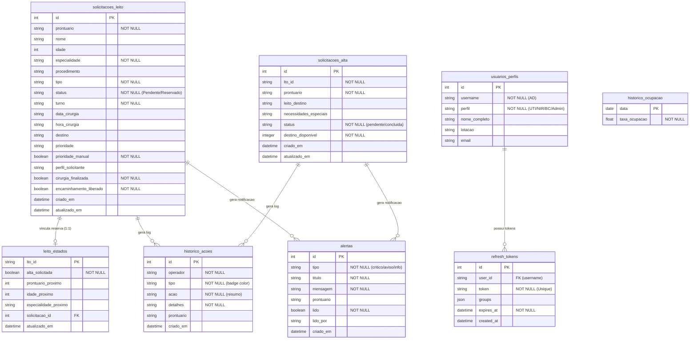

# Modelo de Dados e Dicionário — HC-UTI Manager

Este documento descreve o modelo físico e lógico dos dados armazenados no banco de dados SQLite local (`app.db`) e o dicionário de campos utilizados na integração com o AGHU.

---

## 1. Modelo Entidade-Relacionamento (ERD)



---

## 2. Dicionário de Dados (Tabelas do Sistema)

### A. Tabela `solicitacoes_leito`
Armazena a fila de solicitações de vagas pós-operatórias ou reguladas para a UTI.

*   `id` (INTEGER, PK, Autoincrement): Chave primária.
*   `prontuario` (VARCHAR(50)): Identificador único do prontuário do paciente no AGHU.
*   `nome` (VARCHAR(150)): Nome completo do paciente.
*   `idade` (INTEGER): Idade do paciente no momento da solicitação.
*   `especialidade` (VARCHAR(100)): Especialidade médica responsável (ex: Cardiologia).
*   `procedimento` (VARCHAR(250)): Nome do procedimento cirúrgico.
*   `tipo` (VARCHAR(50)): Tipo de leito solicitado (ex: Cirurgico, HEM, Obstetrico).
*   `status` (VARCHAR(50)): Estado da solicitação (`Pendente`, `Reservado`).
*   `turno` (VARCHAR(50)): Turno da cirurgia (`Manha`, `Tarde`, `Noite`).
*   `prioridade` (VARCHAR(10)): Rank sequencial na fila (ex: `P1`, `P2`, ...).
*   `prioridade_manual` (BOOLEAN): Define se a prioridade foi fixada manualmente pelo operador.

### B. Tabela `leito_estados`
Gere o estado e vínculos extras dos leitos físicos da UTI que não existem no AGHU.

*   `lto_id` (VARCHAR(14), PK): Nome identificador do leito físico (ex: `Leito 05`).
*   `alta_solicitada` (BOOLEAN): Se a UTI solicitou alta deste leito para o NIR regular.
*   `prontuario_proximo` (INTEGER): Prontuário do paciente reservado para este leito.
*   `solicitacao_id` (INTEGER, FK): Referência da solicitação que possui a reserva ativa.

### C. Tabela `solicitacoes_alta`
Controla os pedidos de transferência de pacientes que já receberam alta clínica da UTI.

*   `id` (INTEGER, PK, Autoincrement): Chave primária.
*   `lto_id` (VARCHAR(14)): Identificador do leito de origem na UTI.
*   `prontuario` (VARCHAR(50)): Prontuário do paciente que está de alta.
*   `leito_destino` (VARCHAR(100)): Descrição do leito de destino definido pelo NIR.
*   `status` (VARCHAR(50)): Status do processo (`pendente`, `concluida`).
*   `destino_disponivel` (INTEGER): Flag binário (0/1) indicando se a enfermaria já disponibilizou a vaga física.

### D. Tabela `usuarios_perfis`
Define perfis de privilégios de acesso locais a partir da autenticação de usuários do AD.

*   `id` (INTEGER, PK, Autoincrement): Chave primária.
*   `username` (VARCHAR(50), Unique): Usuário de rede do funcionário (Ebserh).
*   `perfil` (VARCHAR(50)): Role operacional no sistema (`Administrador`, `UTI`, `NIR`, `Solicitante de Leito`, `Comum`).
*   `nome_completo` (VARCHAR(100)): Nome social/profissional.

### E. Tabela `refresh_tokens`
Sessões de refresh token persistidas localmente para renovação segura de token JWT.

*   `id` (INTEGER, PK): Chave primária.
*   `user_id` (VARCHAR): Username de auditoria do AD.
*   `token` (VARCHAR, Unique): Token físico em hash criptografado.
*   `expires_at` (DATETIME): Data e horário limite de expiração da sessão.

### F. Tabela `historico_ocupacao`
Consolida histórico diário para geração de gráficos estatísticos do painel do Gestor.

*   `data` (DATE, PK): Data de fechamento do indicador.
*   `taxa_ocupacao` (FLOAT): Porcentagem de ocupação agregada naquele dia.


---

## 3. Schema JSON de Validação (Criação de Solicitação)

Schema utilizado pelas APIs do backend para validação das requisições recebidas via frontend:

```json
{
  "$schema": "http://json-schema.org/draft-07/schema#",
  "title": "SolicitacaoLeitoPayload",
  "type": "object",
  "properties": {
    "prontuario": { 
      "type": "string", 
      "pattern": "^[0-9]+$",
      "description": "Prontuário numérico do paciente cadastrado no AGHU"
    },
    "tipo": { 
      "type": "string", 
      "enum": ["Cirurgico", "HEM", "Obstetrico", "UTI", "Outro"] 
    },
    "prioridade": { 
      "type": ["string", "null"],
      "pattern": "^P[0-9]+$"
    },
    "perfil_solicitante": { 
      "type": "string",
      "enum": ["BC", "COB", "HEM", "UTI", "NIR", "Administrador"]
    }
  },
  "required": ["prontuario", "tipo", "perfil_solicitante"]
}
```

---

## 4. Regras de Integridade de Dados

*   **Não-Duplicidade de Fila:** Um paciente com prontuário ativo em status `Pendente` ou `Reservado` não pode ter uma segunda solicitação aberta no sistema.
*   **Vínculo Unívoco de Reserva:** Cada leito físico só pode ter uma única reserva ativa (`solicitacao_id` único no `leito_estados`).
*   **Auditoria Inalterável (Append-Only):** A tabela `historico_acoes` não aceita comandos de `UPDATE` ou `DELETE` em nível de aplicação. Todo evento gera um novo registro.
*   **Concorrência Travada:** A tabela de `alertas` só é alimentada por transações controladas via `asyncio.Lock` contra chamadas simultâneas de microsssegundos.
